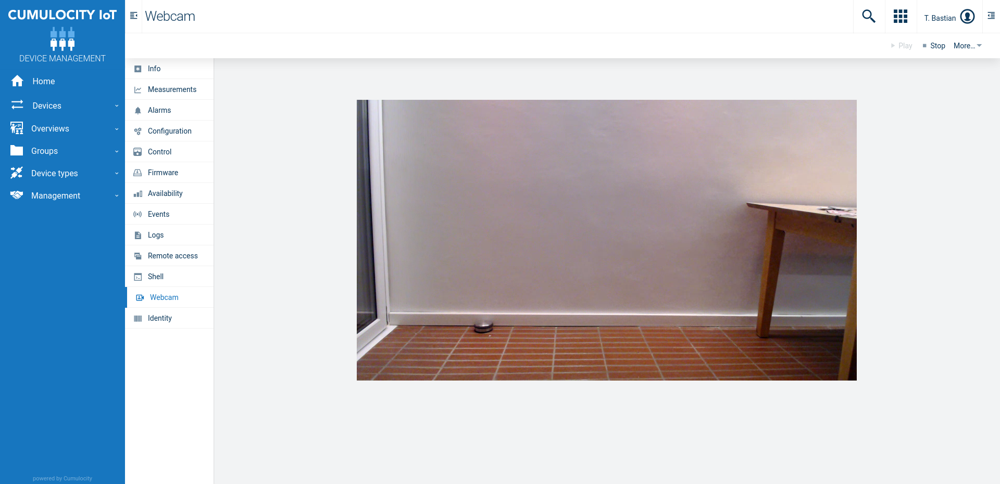

# Cumulocity WebRTC Webcam Plugin

A plugin that allows to access the webcam of compatible Cumulocity devices via [WebRTC](https://en.wikipedia.org/wiki/WebRTC).
WebRTC allows to create a peer-to-peer connection between the Cumulocity device and the browser to stream the video.
Because of that the video traffic does not have to go through another server or e.g. Cumulocity, which saves bandwith and costs.

The Webcam plugin adds a Webcam tab to compatible devices in the app you install it to. You can e.g. install it to the `Devicemanagement` or `Cockpit` application.

The plugin uses by default some [STUN servers](https://de.wikipedia.org/wiki/Session_Traversal_Utilities_for_NAT) by Google to find the public IP addresses of the peer in order to establish the peer-to-peer connection. You can configure a different set of [ICE servers](https://en.wikipedia.org/wiki/Interactive_Connectivity_Establishment) (STUN or TURN) via the configuration plugin included in the package.

Depending on the firewall setup beteen the two peers it might happen that a peer-to-peer connection can not be established.
In that case a third party [TURN server](https://en.wikipedia.org/wiki/Traversal_Using_Relays_around_NAT) is required, where the video traffic passes through. You can host such a server on your own with e.g. [Coturn](https://github.com/coturn/coturn).

Have a look at this [thin-edge extension](https://github.com/thin-edge/thin-edge.io_examples/pull/54) for a sample Cumulocity agent, that supports this feature.

The plugin uses Cumulocity's remote-access-connect feature in `PASSTHROUGH` mode to establish a WebSocket connection between the browser and an WebRTC server like e.g. [go2rtc](https://github.com/AlexxIT/go2rtc) running on the device. Ensure that this microservice together with it's `PASSTHROUGH` mode is available on your Cumulocity tenant.

With the current set of changes this plugin is no longer compatible with the [electron-agent](https://github.com/SoftwareAG/cumulocity-electron-agent).

# Useful links 

📘 Explore the Knowledge Base   
Dive into a wealth of Cumulocity IoT tutorials and articles in our [Tech Community Knowledge Base](https://tech.forums.softwareag.com/tags/c/knowledge-base/6/cumulocity-iot).  

💡 Get Expert Answers    
Stuck or just curious? Ask the Cumulocity IoT experts directly on our [Forum](https://tech.forums.softwareag.com/tags/c/forum/1/Cumulocity-IoT).   

🚀 Try Cumulocity IoT    
See Cumulocity IoT in action with a [Free Trial](https://techcommunity.softwareag.com/en_en/downloads.html).   

✍️ Share Your Feedback    
Your input drives our innovation. If you find a bug, please create an issue in the repository. If you’d like to share your ideas or feedback, please post them [here](https://tech.forums.softwareag.com/c/feedback/2). 

More to discover
* [How to install a Microfrontend Plugin on a tenant and use it in an app?](https://tech.forums.softwareag.com/t/how-to-install-a-microfrontend-plugin-on-a-tenant-and-use-it-in-an-app/268981)  
* [Cumulocity IoT Web Development Tutorial - Part 1: Start your journey](https://tech.forums.softwareag.com/t/cumulocity-iot-web-development-tutorial-part-1-start-your-journey/259613) 
* [The power of micro frontends – How to dynamically extend Cumulocity IoT Frontends](https://tech.forums.softwareag.com/t/the-power-of-micro-frontends-how-to-dynamically-extend-cumulocity-iot-frontends/266665) 

---

These tools are provided as-is and without warranty or support. They do not constitute part of the Software AG product suite. Users are free to use, fork and modify them, subject to the license agreement. While Software AG welcomes contributions, we cannot guarantee to include every contribution in the master project.
